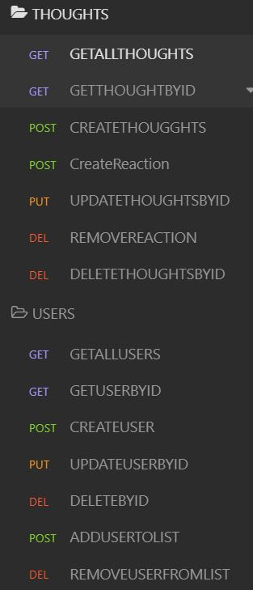

<h1 align="center"> NoSQL Challenge: Social Network API 👋</h1>
  

    
    
    
    
    
    

  

    
    
    
    
    

   
<h4>Designed and coded by <a href="https://github.com/fizzaaz">FIZZA ZAIDI</a></h4> 

## Description

🔍MongoDB is a popular choice for many social networks due to its speed with large amounts of data and flexibility with unstructured data. Over the last part of this course, you’ll use several of the technologies that social networking platforms use in their full-stack applications. Because the foundation of these applications is data, it’s important that you understand how to build and structure the API first.

In this app, I have created an API for a social network web application where users can share their thoughts, react to friends’ thoughts, and create a friend list. You’ll use Express.js for routing, a MongoDB database, and the Mongoose ODM. In addition to using the Express.js (Links to an external site.) and Mongoose (Links to an external site.) packages, you may also optionally use a JavaScript date library of your choice or the native JavaScript Date object to format timestamps

✋ [GitHub Repository](https://github.com/fizzaaz/Social-Network-API)

## ✋User Requirements

AS A social media startup
I WANT an API for my social network that uses a NoSQL database
SO THAT my website can handle large amounts of unstructured data  

## ✋Project Requirements

GIVEN a social network API
* WHEN I enter the command to invoke the application THEN my server is started and the Mongoose models are synced to the MongoDB database
* WHEN I open API GET routes in Insomnia Core for users and thoughts THEN the data for each of these routes is displayed in a formatted JSON
* WHEN I test API POST, PUT, and DELETE routes in Insomnia Core THEN I am able to successfully create, update, and delete users and thoughts in my database
* WHEN I test API POST and DELETE routes in Insomnia Core THEN I am able to successfully create and delete reactions to thoughts and add and remove friends to a user’s friend list

## Table of Contents
- [Description](#description)
- [User Requirements](#user-requirements)
- [Project Requirements](#project-requirements)
- [Installation](#installation)
- [Usage](#usage)
- [Testing](#testing)
- [Contribution](#contribution)
- [Questions](#questions)

## 💻Usage
  
Run the following command at the root of your project :
  
`npm start`     

## 💾Installation

`npm install moongoose`

`npm install express`

## ✏️Testing

No testing is currently set up

## 👪Contribution

  Email me 

## Questions

 If you have any queries feel free to contact me at ✉️ fizz.zehra14@gmail.com.
 You can also reach me out through my Github profile at  👋[fizzaaz](https://github.com/fizzaaz/).

